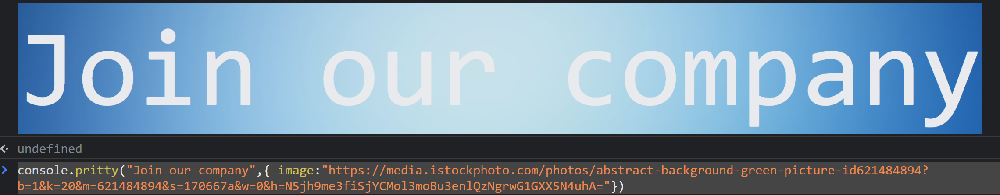

<div align="center">
  <h1>console.pretty</h1>

  <a href="https://www.emojione.com/emoji/1f3a8">
    
  </a>

  <p>Pretty console logging.</p>
</div>

<hr />

[![version][version-badge]][package]
[![MIT License][license-badge]][license]
[![styled with prettier][prettier-badge]][prettier]

## The problem

You're trying to log information, but have a hard time tracking down what the
output means, where it came from, or can't find what you're looking for quickly.

## This solution

Use colors to easily parse through your console.

## Example

```js
import log, { green } from "console.pretty";

const handleOnClick = () => {
  log.blue("Click!");
};

const handleMouseover = () => {
  green("Mouseover!");
};
```

## Installation

This module is distributed via [npm][npm] which is bundled with [node][node] and
should be installed as one of your project's `dependencies`:

```
$ npm install console.pretty
```

or

```
$ yarn add console.pretty
```

# how to build package from source
```bash
npm install 
npm install -g browserify
npm run build
browserify source.js -o browser.js

```
# examples
```js
require( 'console.pritty' )( console );

console.pritty("works",{border:true,color:"brown",background:"blue",borderSize:"1mm",image:"https://emojis.slackmojis.com/emojis/images/1539890226/4845/rickroll.gif?1539890226"})

console.pritty("We're Hiring!",{  color:"black",image:"https://media.istockphoto.com/photos/abstract-background-green-picture-id621484894?b=1&k=20&m=621484894&s=170667a&w=0&h=N5jh9me3fiSjYCMol3moBu3enlQzNgrwG1GXX5N4uhA="})
```


### Photo with border
```js
console.pritty("We're Hiring!",{ color:"black",  border:true,image:"https://media.istockphoto.com/photos/abstract-background-green-picture-id621484894?b=1&k=20&m=621484894&s=170667a&w=0&h=N5jh9me3fiSjYCMol3moBu3enlQzNgrwG1GXX5N4uhA="})

```

## API

By default, the following colors are available:

- blue
- brown
- gray
- green
- red
- orange
- purple
- yellow

However, you can also build your own logger using the provided `createLogger`.

```js
import { createLogger } from "console.pretty";

const pink = createLogger("#FFC0CB", "#000000");

pink("My pink logger");
```

## LICENSE

MIT

<!--
Links:
-->

<!-- prettier-ignore-start -->

[version-badge]: https://img.shields.io/npm/v/console.pretty.svg?style=flat-square
[package]: https://www.npmjs.com/package/console.pretty
[license-badge]: https://img.shields.io/npm/l/console.pretty.svg?style=flat-square
[license]: https://github.com/bvaughn/console.pretty/blob/master/LICENSE
[prettier-badge]: https://img.shields.io/badge/styled_with-prettier-ff69b4.svg
[prettier]: https://github.com/prettier/prettier
[npm]: https://www.npmjs.com
[node]: https://nodejs.org
